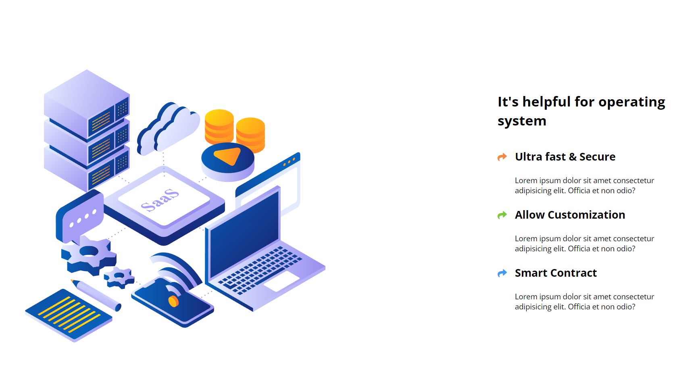
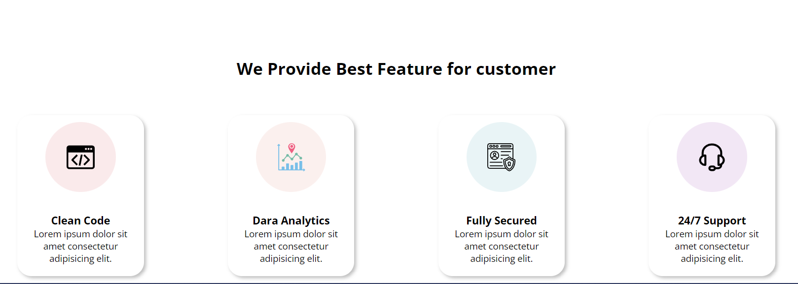

 

## Project Name: SAAS Landing Page
### By Yash Shamnani

##  Live Link -: [SAAS](https://yashshamnani-buisness-landing-page.netlify.app/)
---

##  Technologies used

> HTML5

> CSS4
---

## learning from this project

-  Learnt about Positioning
-  Learn to integrate font awesome icons
- Learned about How to make Page Responsive
- Learned how to make cards
- Learned about Media Queries

---

## Time taken to Finish this project

- I have taken 9 hours to complete this project Majority of my time was spent in working of css , flexbox , positioning , responsiveness.
 

## Project Overview

 ## Contact
 - **Name :** Yash Shamnani
- **Email :**  shyamnaniyash@gmail.com

 - [![LinkedIn][linkedin-shield]][linkedin-url]

 [linkedin-shield]: https://img.shields.io/badge/-LinkedIn-black.svg?style=for-the-badge&logo=linkedin&colorB=0B5FBB
[linkedin-url]:  https://www.linkedin.com/in/yash-shamnani-a76a34203